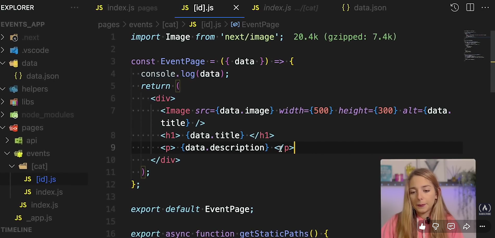
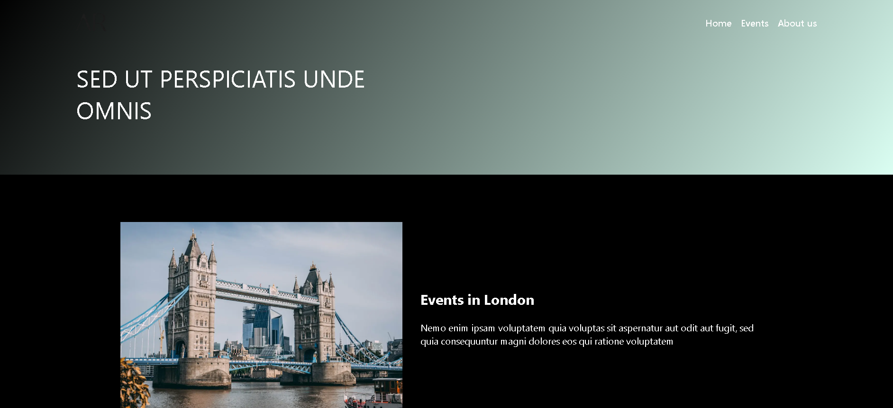

# Events App

A full-stack events management application built with Next.js.

## Overview

This project demonstrates a complete Next.js application for managing events, featuring server-side rendering, database integration, and modern React patterns.

## Learning Resource

This project was built following the comprehensive freeCodeCamp tutorial:

[Next.js React Framework Course – Build and Deploy a Full Stack App From Scratch](https://www.youtube.com/watch?v=KjY94sAKLlw)

Instructor: Alicia Rodriguez (@timetocode_with_ali)

This course covers:
- Building a full-stack application from scratch with Next.js
- Server-side rendering (SSR) and static site generation (SSG)
- Database integration with Prisma and PostgreSQL
- Authentication and user management
- Deployment to Vercel with automatic GitHub integration
- Modern TypeScript and React best practices

## Screenshots

## Live Demo

Deployed on Vercel: [https://events-app-beta.vercel.app/](https://events-app-beta.vercel.app/)
